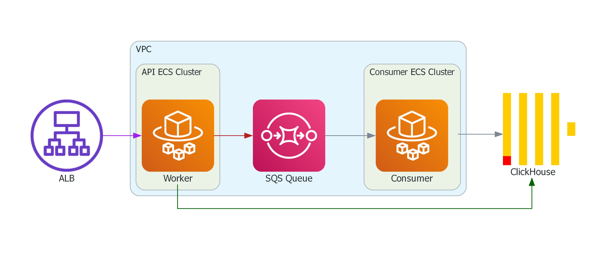

# event-analytics-service
An event ingestion and analytics service.

[](https://github.com/BarkinBalci/event-analytics-service/actions/workflows/ci.yml)
[](https://github.com/BarkinBalci/event-analytics-service/actions/workflows/cd.yml)


## Architecture


The service uses a two-component architecture that separates ingestion from processing. The API Service accepts HTTP events, publishes them to SQS, and immediately returns a 202 Accepted response. Meanwhile, the Consumer Service independently polls SQS and writes events to ClickHouse for analytics.

This design keeps the API highly available since it never waits for database writes, while SQS buffers events between the two services. Both components can scale independently based on their workloads, ensuring the system handles traffic spikes without losing events.

## Prerequisites

- Go 1.25+
- Docker
- Docker Compose

## Quick Start

```bash
# Create an .env file from the .env.example
make env
```
```bash
# Start the application
docker-compose up -d
```

```bash
# Check health
curl http://localhost:8080/health
```

```bash
# Post an event
curl -X POST http://localhost:8080/events \
  -H "Content-Type: application/json" \
  -d '{
    "event_name": "product_view",
    "channel": "web",
    "campaign_id": "cmp_987",
    "user_id": "user_123",
    "timestamp": '$(date +%s)',
    "tags": ["test"],
    "metadata": {"test": true}
  }'
```

```bash
# Query metrics grouped by channel
curl "http://localhost:8080/metrics?event_name=product_view&from=1766717657&to=1766747957&group_by=channel"
```

```bash
# Query metrics grouped by hour
curl "http://localhost:8080/metrics?event_name=product_view&from=1766717657&to=1766747957&group_by=hour"
```

```bash
# Query metrics grouped by day
curl "http://localhost:8080/metrics?event_name=product_view&from=1766717657&to=1766747957&group_by=day"
```

## API Documentation

Swagger is available in http://localhost:8080/docs/index.html and [docs/swagger.yaml](docs/swagger.yaml)

## Benchmark

Load test performed with [hey](https://github.com/rakyll/hey) using 250 concurrent connections over 10 minutes:

```bash
hey -z 600s -c 250 -m POST \
    -H "Content-Type: application/json" \
    -d '{"event_name":"product_view","channel":"web","campaign_id":"cmp_987","user_id":"user_123","timestamp":'$(date +%s)',"tags":["test"],"metadata":{"test":true}}' \
    <REDACTED_URL>
```

**Test Configuration:**
- ECS with autoscaling enabled but limited to 10 tasks
- Fargate task specs (I did not have enough time to do right sizing 😅):
  - API: 0.5 vCPU, 1 GB RAM
  - Consumer: 1 vCPU, 2 GB RAM

### Results

```
Summary:
  Total:        600.1190 secs
  Slowest:      1.2400 secs
  Fastest:      0.0406 secs
  Average:      0.1500 secs
  Requests/sec: 5039.5303

  Total data:   214726507 bytes
  Size/request: 214 bytes

Response time histogram:
  0.041 [1]     |
  0.161 [995221]        |■■■■■■■■■■■■■■■■■■■■■■■■■■■■■■■■■■■■■■■■
  0.281 [2900]  |
  0.400 [913]   |
  0.520 [408]   |
  0.640 [280]   |
  0.760 [190]   |
  0.880 [63]    |
  1.000 [20]    |
  1.120 [2]     |
  1.240 [2]     |

Latency distribution:
  10% in 0.0442 secs
  25% in 0.0452 secs
  50% in 0.0469 secs
  75% in 0.0492 secs
  90% in 0.0519 secs
  95% in 0.0561 secs
  99% in 0.1079 secs

Details (average, fastest, slowest):
  DNS+dialup:   0.0000 secs, 0.0406 secs, 1.2400 secs
  DNS-lookup:   0.0000 secs, 0.0000 secs, 0.1176 secs
  req write:    0.0000 secs, 0.0000 secs, 0.0022 secs
  resp wait:    0.1497 secs, 0.0406 secs, 1.2399 secs
  resp read:    0.0001 secs, 0.0000 secs, 0.0081 secs

Status code distribution:
  [202] 1000000 responses
```

## Design Decisions

### Why ClickHouse?

I went with ClickHouse because it's built specifically for this kind of workload with lots of writes, time-based queries, and aggregations, and the ReplacingMergeTree engine can handle deduplication without much developer effort.

### Why AWS SQS?

I considered Kafka for lower latency at first, but its operational overhead and more so cost floor had pushed me towards SQS. 

### Why Fargate?

I chose Fargate because I didn't want to spend time and resources managing and configuring EC2 instances. Deployment is as simple as pushing a Docker image and updating the ECS task definition.

## Known Limitations

- API has no authentication, rate limiting, or explicit request size validation.
- Health check endpoint does not verify ClickHouse or SQS connectivity, which means the load balancer might route traffic to instances with broken dependencies.
- Fargate autoscaling and task sizes were chosen arbitrarily and likely need right sizing based on production profiling. 
- Consumer retry logic relies on SQS visibility timeout expiration rather than immediate retry with exponential backoff.